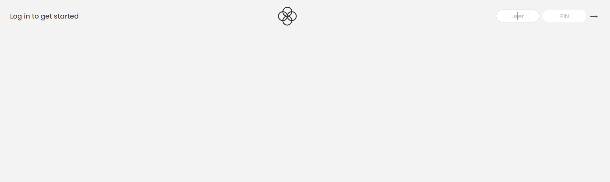
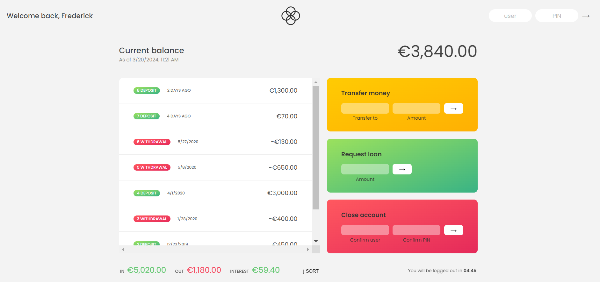

# Bankist App

Bankist App is a web application designed to simulate banking operations such as logging in, transferring money, requesting loans and closing accounts. It provides a user-friendly interface to interact with various banking functionalities.

## Preview

## Usage

To use this application, follow these steps:

1. **Download:** Download the project files from the repository.
2. **Open in Browser:** Locate the `index.html` file in the downloaded project folder and open it in a web browser.
3. **Interact:** Once the application is open in your browser, you can interact with its various features such as logging in, transferring money, requesting loans, and closing accounts.

## Features

- **Login:** Users can log in to their accounts using their username and PIN.
- **View Balance:** Users can view their current balance along with the date of the last update.
- **View Movements:** Users can see their transaction history including deposits and withdrawals.
- **Transfer Money:** Users can transfer money to other accounts by providing the recipient's username and the amount.
- **Request Loan:** Users can request a loan by specifying the desired loan amount. The loan request is granted if the user has a sufficiently good transaction history.
- **Close Account:** Users can close their account by confirming their username and PIN. Upon closure, the account is removed from the system.
- **Sort Movements:** Users can sort their transaction history by clicking the "SORT" button, which arranges transactions in ascending or descending order based on their amounts.

## Technologies Used

The Bankist App is built using the following technologies:

- **HTML:** For the structure and layout of the web pages.
- **CSS:** For styling and designing the user interface.
- **JavaScript:** For implementing interactive features and logic.

## Credits

- This project was inspired by Jonas Schmedtmann's [Bankist App](https://www.udemy.com/course/the-complete-javascript-course/) from the Udemy course "The Complete JavaScript Course 2021: From Zero to Expert!".
- CSS design techniques were learned from the provided CSS file (`style.css`).
